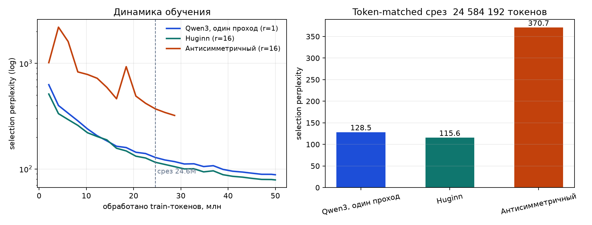

# Looped Model

Лучший чекпойнт: **https://huggingface.co/vladotpad/looped-qwen3-huginn-fineweb**

Из мощностей у меня был MacBook Pro на M1 Max. Предварительные прогоны шли на нём в MPS, а точный якобиан блока MPS не поддерживает, поэтому диагностику я считал на процессоре.

Был ещё доступ к видеокартам, но только по университетским очередям, и я им воспользовался. Темы задания для меня новые, я долго разбирался в каждой из них, и на прогоны времени оставалось столько, сколько оставалось. Поэтому итоговые прогоны идут без нескольких сидов и на укороченном бюджете: 50 миллионов токенов вместо разрешённых ста. Я знаю, зачем нужны несколько сидов и полный бюджет, но с оставшимся временем сосредоточился на том, что показывают валидационные метрики и динамика обучения там, где сигнал отделяется от шума по графикам.

Мой бэкграунд — представления данных, в большей степени мультимодальные, и в самой теме зацикленных моделей я относительно неопытен. Исходя из этого я старался не ограничиваться стандартными прогонами, а придумать что-то своё: аккуратно проводить эксперименты по статьям умеет и агент, интереснее было проверить собственные гипотезы.

Один вариант с 16 циклами делает в 16 раз больше применений блока, чем один проход, поэтому все сравнения ниже сделаны при равном числе токенов, но не при равном объёме вычислений.

## Задача и протокол

Нужно получить низкую перплексию на валидации FineWeb при не более чем 10M параметров и не более чем 100M токенов обучения, на блоках Qwen3, и заставить один и тот же рекуррентный блок выполнять много полезных повторов. Главный вопрос отчёта: почему очередной повтор меняет предсказание или перестаёт его менять.

Все варианты используют один уменьшенный Qwen3: четыре физических блока, \(d=384\), шесть query-голов, три KV-головы, размер головы 128, \(d_{ff}=1152\), RoPE, QK-norm, GQA, SwiGLU, pre-norm RMSNorm и связанные эмбеддинги. Ни один вариант не превышает 10M параметров без эмбеддингов. Данные — `HuggingFaceFW/fineweb`, сабсет `sample-10BT`, ревизия `9bb295d`; документы 0:200 идут в отборочную выборку, 200:2000 в финальную валидацию, обучение начинается с 2000. Токенизатор один на все сравнения, обучен только на обучающих документах, поэтому ни отборочная выборка, ни финальная валидация в него не протекают.

Оптимизация везде одна: AdamW, \(\beta=(0.9,0.95)\), затухание весов 0.1 только на матрицах, обрезка градиента 1.0, шаг обучения 3e-3 с двумястами шагами разогрева и косинусным спадом до 3e-4, длина последовательности 512, батч 16. Остановка по фиксированному бюджету токенов. Предварительные прогоны шли на ноутбуке в одинарной точности, итоговые — на A100 в bf16.

С зацикленными моделями у меня сложная история, потому что непонятно, какое может быть преимущество от того, что один и тот же блок много раз проходится по одному и тому же месту. Суть в том, что я применяю один блок на новые входы, и получается каждый раз новое преобразование. Это композиция функций, и она похожа на итеративные алгоритмы, а итеративные алгоритмы в непрерывном пределе описываются динамическими системами. Отсюда и вся тема со стабильностью, и Deep Equilibrium Models, которые мне тоже пришлось изучить для этого.

Нелинейная функция активации, которая должна как-то подвинуть поданный ей на вход вектор, задаёт своего рода поле: для каждого входа у неё свой выход, то есть можно составить поле направлений, куда она может подвинуть определённый вход. Если применять её последовательно, то для каких-то входов траектория будет осциллировать, балансировать, крутиться; какие-то сойдутся к точке эквилибриума, про которую в этих моделях теоретически всё написано и куда они стремились, хотя это совершенно не факт, что самая оптимальная точка; а какие-то разойдутся. Казалось бы, если в обычной модели есть слои, которые сжимают представление или наоборот не сжимают, то удобнее всего иметь представления, которые чуть-чуть меняются, но не пытаются сойти с рельс ни в одну, ни в другую сторону. Смысл либо в небольшой сходимости, либо в том, чтобы отходить, но не взрываться, по крайней мере на десятках итераций.

Изначально, как и со стирингом, у меня была идея про манифолды и про представления. Здесь она не сильно оправдалась, потому что возникает проблема курицы и яйца: с одной стороны я пытаюсь анализировать активации, с другой стороны я архитектурой эти активации и задаю. Как я количество циклов поставлю, так оно и будет.

Я попробовал сделать базовую модель по схеме Huginn и самую наивную, в которой просто обновляется состояние, плюс ещё пару не особо доработанных идей. Получилось так, что всё это учится, но насыщается очень быстро: косинус обновления не очень высокий, и модели страдают тем, что у них сильно поднимается норма, то есть представления взрываются по умолчанию. Закрывает эту норму только RMSNorm, нормализатор, который существует уже после преобразования. Модель проитерировала и просто удлинила вектор в какую-то сторону, увеличила его, но направление не поменяла, а RMSNorm обратно сжимает длину вектора до предыдущего значения. Получается, что изменений по сути нет, они пропадают к какому-то шагу.

Отсюда проверяемая формулировка. Сатурация вызвана не тем, что состояние сошлось к полезной неподвижной точке, а тем, что рост нормы состояния съедается финальным RMSNorm. Тогда абсолютное приращение не должно сходиться к нулю, относительное должно падать одновременно с ростом нормы состояния, а ошибка по глубине не должна улучшаться. Опровергнуть это может обратная картина: абсолютное приращение одного и того же слоя сходится к нулю при стоящей на месте норме.

Проверка глубины цикла на 98 304 токенах дала именно предсказанное. Ни один вариант не сходится в исходном скрытом пространстве, абсолютное приращение одного и того же слоя остаётся порядка \(10^3\), а относительное приращение уменьшается одновременно с ростом нормы состояния, поэтому сам по себе он создавал ложное впечатление сходимости. Обучение на 8 и 16 циклах переносит лучшую глубину оценки к 8 и 16, а обучение на 2 и 4 циклах при таком бюджете оставляет лучшую ошибку после одного цикла.

## Метод

Теоретически обосновано, что без номера шага цикла и без подмешивания исходного входа вся эта система теряет смысл. Но мне хотелось проверить именно самый топорный лупинг, композицию функций в чистом виде, потому что все остальные примочки уже существуют: обоснованные гейты, фильтры данных, проброс через слой, эмбеддинги шага, контроллеры, предикторы момента остановки. Они накладываются сверху как модули и удерживают систему в рабочем состоянии. Мне было важно сначала увидеть, что ломается без них.

### Антисимметричный переход

Идея в том, что я могу эмбеддинг контролировать, а не просто наблюдать за ним. До манифолдов дело здесь даже не доходит: видно, что направление просто увеличивается, и я смотрю уже на преобразование, а не на фиксированные точки выхода. Отсюда мысль: вместо манифолда заняться самой нормой. Что если заставить обновление быть математически ограниченным.

Разбираясь, как это сделать, я возвращаюсь к университетской линейной алгебре и вспоминаю, что существуют кососимметричные матрицы, определяемые своим свойством. У такой матрицы все собственные значения мнимые, то есть она не будет ни увеличивать, ни уменьшать длину вектора — это линейное преобразование, но в изменении длины оно не участвует. Именно это предлагается в статье [Stable Architectures for Deep Neural Networks](https://arxiv.org/abs/1705.03341). Там же, чтобы длину этих векторов всё-таки можно было менять, но не резко, добавлен небольшой член, дающий формуле люфт, и сингулярные значения оказываются около единицы. То есть вместо того чтобы взять любые веса, я делаю матрицу весов особенной, такой, что она не даёт распределениям выйти за пределы.

Повтор устроен так:

$$
h_{t+1}=(1-\gamma)\,h_t+\sigma\!\left(g([h_t,e])\right)\,(W-W^\top)\,z_t, \qquad z_t=R(h_t).
$$

Здесь \(R\) — общий блок из четырёх слоёв Qwen3, \(W-W^\top\) кососимметрична по построению, \(g\) — скалярный гейт, \(\gamma\) — тот самый люфт. Исходный эмбеддинг входит только в гейт: адаптера склейки, как у Huginn, здесь нет, потому что смысл варианта в голой композиции с ограниченной нормой. Обучение и оценка идут на шестнадцати циклах, градиент проходит через все повторы, ошибка — только предсказание следующего токена, без вспомогательных членов.

В модели идут нелинейности, а не только линейные преобразования, поэтому логично было добавить сигмоиду как функцию активации вместо популярной для таких моделей ReLU: её значения лежат от нуля до единицы, и она не даёт выйти за пределы. Это аппроксимация первого порядка, поэтому люфты будут, но не сильные, и к этому я был готов. Производная сигмоиды ограничена сверху \(1/4\), поэтому гейт сам по себе разогнать переход не может.

Здесь возникает развилка. В чистом виде AntisymmetricRNN применяет вращение к самому состоянию: \(\Delta=\sigma(g)\,(W-W^\top)h_t\). Тогда приращение строго ортогонально состоянию, потому что \(h^\top(W-W^\top)h=0\) тождественно, и норма растёт только во втором порядке. Но в таком виде блоки Qwen3 в цикл не попадают вовсе, и модель перестаёт быть зацикленным трансформером. Поэтому в итоговом прогоне вращение применяется к выходу блоков, \(z_t=R(h_t)\): трансформер работает внутри цикла, но ортогональность приращения теряется.

### Контроллер и слои как токены

Вторая идея оказалась для меня более интересной. Если думать про лупинг именно как про композицию функций, то важен порядок разных функций. Каждый слой — это по сути одна нелинейная функция, и я могу их по-разному собирать. Тогда всю задачу с лупингом можно обобщить: пусть не просто какие-то веса зацикливаются нужное количество раз или в фиксированном порядке, а какие-то скипаются, — пусть у меня будет набор слоёв и отдельная модель-контроллер, которая эти слои буквально выдаёт, то есть классифицирует и выдаёт, как языковая модель выдаёт токены. Layers as tokens: контроллер может в любой последовательности выдавать уже предобученные слои под любую задачу. Объединить эти две идеи в будущем было бы здорово.

Контроллер здесь — рекуррентная сеть, которая получает исходный эмбеддинг и историю своих прошлых действий. На обучении оракул выбирает блок с наименьшей ошибкой на токене, состояние идёт по этому маршруту, а контроллер отдельно учится повторять выбор оракула. Блоки учатся на своей ошибке плюс штраф за схожесть выходов, а на инференсе их предложения смешиваются мягким максимумом. Две идеи стыкуются в том, чтобы смешивать не сами предложения, а приращения с ограниченной по построению нормой.

## Результаты

Все варианты учились одновременно на двух A100, по два процесса на карту, с одним токенизатором, одним набором данных, одним сидом и одинаковым бюджетом в 50 миллионов токенов.

| модель | параметров без эмбеддингов | токенов | циклов | применений блока | ошибка | перплексия |
|---|---:|---:|---:|---:|---:|---:|
| Qwen3, один проход | 8 851 840 | 49 995 776 | 1 | 4 | 4.4782 | 88.07 |
| Huginn | 9 147 136 | 49 995 776 | 16 | 32 | 4.3656 | 78.70 |
| Антисимметричный | 9 000 066 | 49 995 776 | 16 | 64 | 5.4458 | 231.78 |
| Контроллер | 9 450 500 | 49 995 776 | 16 | 64 | 10.9545 | 57 208.6 |

Повторы работают: Huginn при 16 циклах даёт выигрыш 10.6% перплексии над одним проходом Qwen3 при равном числе токенов и параметров. Левый график показывает, что это не эффект точки среза. Кривая Huginn идёт ниже кривой одного прохода на всём протяжении обучения и ни разу её не пересекает, а разрыв между ними медленно растёт.

Антисимметричный переход проигрывает обоим, и его кривая идёт заметно выше остальных на всём бюджете. Это отрицательный результат основной идеи.

Сравнение сделано при равном числе токенов, но не при равном объёме вычислений: Huginn делает 32 применения блока против четырёх у одного прохода, антисимметричный вариант — 64.

Разбираясь, почему он так отстал, я посмотрел на приращения состояния по циклам.

| цикл | норма состояния | норма приращения | ошибка на токене |
|---:|---:|---:|---:|
| 1 | 2755.12 | 2755.11 | 5.253 |
| 2 | 2755.12 | 0.00 | 5.253 |
| 16 | 2755.12 | 0.00 | 5.253 |

Начиная со второго цикла приращение равно нулю, и предсказание перестаёт меняться. Обученное затухание оказалось порядка \(10^{-9}\), то есть переход свёлся к \(h_{t+1}=h_t+\sigma(g([h_t,e]))(W-W^\top)z_t\). На первом же цикле норма состояния уходит к 2755, а гейт получает это состояние на вход, и сигмоида обнуляется до машинного нуля. Модель нашла способ выключить луп.

Значит, шестнадцать циклов здесь фактически работают как один, и 231.78 — это перплексия одноцикловой модели с раздутой нормой. Ограничение нормы перехода не спасает, если сама норма состояния успевает вырасти до того, как ограничение начнёт действовать. Сигмоидный гейт на вход по состоянию оказался плохим выбором именно поэтому: он тем сильнее закрывается, чем больше состояние, то есть усиливает ту проблему, которую должен был лечить. Правильнее было бы нормализовать вход гейта или строить приращение так, чтобы его масштаб не зависел от длины состояния.

Контроллер сначала вообще не сделал ни одного шага в общем прогоне: на каждом из 16 циклов он декодирует четыре полных распределения по словарю, и при батче 16 это не помещается в память. Отдельный прогон с батчем 8 занял 35.9 ГиБ и дошёл до тех же 50 миллионов токенов.

## Отрицательные результаты

### Активное обучение

Отдельно у меня была идея применить здесь активное обучение: удобно иметь агента, который распределяет циклы, исходя из метрики определённости. В чистом виде это не активное обучение, но некоторые его идеи прослеживаются.

Я проверил четыре сигнала как предикторы фактической пользы следующего цикла: энтропию, расхождение соседних распределений, чувствительность логитов вдоль приращения и длину Фишера.

| сигнал | корреляция с пользой на первом цикле | на последнем |
|---|---:|---:|
| расхождение соседних распределений | 0.642 | \(-0.101\) |
| длина Фишера | \(-0.559\) | — |
| чувствительность логитов | \(-0.533\) | — |

Сама польза при этом падает почти до нуля уже к девятому циклу. Ни один сигнал не ранжирует её устойчиво, а у двух корреляция отрицательная: большая чувствительность не означает полезное изменение.

Диагностика показала, что все эти метрики измеряют неуверенность модели, а не пользу дополнительного вычисления, и знак зависимости меняется с глубиной. Единая оценка с фиксированным порогом на таких данных не обоснована, поэтому ранний выход в итоговый метод я не вводил. Чтобы понять, есть ли здесь вообще верхний предел, нужна оракульная кривая при равном объёме вычислений; её у меня нет.

Прогон `cycle-probe-100k-r16` на [странице диагностики](report.html).

### Калибровка затухания по нулевому радиальному дрейфу

Я подобрал затухание так, чтобы средний относительный прирост квадрата нормы на отложенной траектории был нулевым, и обучил модель заново с этим значением. Калибровка сделала ровно то, что обещала, и ничего больше: дрейф нормы исчез, а ошибка на отборочной выборке при этом стала хуже.

Подавление радиального роста не улучшило обучение, поэтому более достойным кандидатом остался некалиброванный вариант, а радиальный рост так и не доказан как причина плохого качества. Калиброванный вариант я оставил геометрическим контролем.

### Контроллер над слоями

Контроллер на полном бюджете не обучился вовсе, и разбор оказался содержательнее самого числа.

| величина | начало обучения | конец обучения |
|---|---:|---:|
| обучаемая цель | 10.685 | 3.089 |
| ошибка контроллера к оракулу | 1.387 | 1.315 |
| ошибка на валидации при инференсе | 10.248 | 10.954 |

Равномерное предсказание по словарю из 16384 токенов даёт 9.704, а случайный выбор одного блока из четырёх даёт 1.386. Блоки под маршрутом оракула учатся хорошо, а контроллер за пятьдесят миллионов токенов не ушёл от случайного угадывания. На инференсе смесь ведёт состояние по маршруту, которого блоки никогда не видели, поэтому валидация оказывается хуже равномерного предсказания.

Причина здесь не в нормах и не в геометрии: обучение и инференс идут по разным маршрутам. У Huginn норма тоже растёт, но путь один и тот же, и он работает. Чтобы идея со слоями как токенами заработала, контроллер должен получать сигнал от того же прохода, который потом используется на инференсе, а не имитировать оракула отдельной ошибкой. Мне эта идея по-прежнему кажется интересной, и я был бы рад довести её до рабочего вида на стажировке.

## Масштабирование

Huginn сохраняет число обучаемых параметров при росте числа повторов: растёт только число применений одного и того же блока, поэтому память под веса не меняется, а память под активации растёт линейно по глубине цикла и ограничивается усечением градиента. Этот механизм не упирается в размер модели: он не добавляет обучаемых таблиц и не зависит от малой ширины.

Антисимметричный переход в этом смысле масштабируется так же дёшево, но масштабировать его нет смысла, пока он проигрывает на малом масштабе. Кососимметричное ограничение убирает у перехода степени свободы независимо от ширины, поэтому нет основания ожидать, что на большем \(d\) оно вдруг начнёт помогать.

У работы есть понятные границы. Все прогоны сделаны на одном сиде и на пятидесяти миллионах токенов вместо разрешённых ста, финальную валидацию я не открывал, глубже шестнадцати циклов не заходил. Контроллер обучался на меньшем батче, поэтому сравним с остальными по числу токенов, но не по числу шагов оптимизатора.

Отдельно назову недостающий контроль. В итоговом сравнении нет голого лупа: тех же четырёх блоков Qwen3, прогнанных шестнадцать раз подряд без кососимметричного ограничения и без адаптера склейки. Код для него есть, но с числом циклов больше единицы он не запускался. Без этой строки нельзя развести две причины: ухудшило ли результат само ограничение нормы или шестнадцать циклов голой композиции плохи сами по себе. Это первое, что стоит прогнать дальше.
